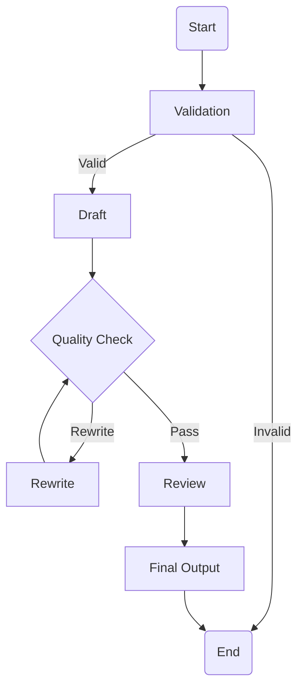

# Job Description Agent (Prod-JD-Agent)

A production-grade AI agent that generates high-quality, structured, and ATS-friendly Job Descriptions from raw inputs using LLMs.

This is not a single-prompt toy. It is a modular, extensible JD generation pipeline designed with real engineering discipline.

---

## 🚀 Features

- Agent-based architecture (multi-node, not monolithic)
- Clean, structured Job Description generation
- Automatic rewrite and quality checks
- Deterministic review and finalization
- Modular nodes (easy to extend or replace)
- Environment-based secret management
- Production-ready project structure

---

## 🏗️ High-Level Architecture

The Job Description Agent follows a deterministic, multi-stage agent pipeline.
Each stage has a single responsibility and explicit control flow.



### Flow Explanation

1. **Validation**
   - Verifies required fields and normalizes input
   - Invalid inputs terminate the pipeline early

2. **Draft**
   - Generates the first structured Job Description draft

3. **Quality Check**
   - Evaluates structure, clarity, realism, and completeness
   - Decides whether a rewrite is required

4. **Rewrite (Loop)**
   - Iteratively improves the draft until quality thresholds are met

5. **Review**
   - Final polish for consistency, tone, and ATS readiness

6. **Final Output**
   - Produces the finalized Job Description

---

## 📁 Project Structure

```text
Prod_JD_Agent/
├── app.py                 # Entry point (Streamlit / runner)
├── jd_agent/
│   ├── agent.py           # Agent graph definition
│   ├── nodes/             # Individual agent nodes
│   ├── state/           # State & validation schemas
│   ├── prompts/           # Prompt templates
│   └── utils/             # Helpers, logging, utilities
├── .env.example           # Environment variable template
├── .gitignore
└── README.md
```


---

## 🧪 Requirements

- Python 3.10+
- Virtual environment recommended

---

## 🔧 Setup Instructions

### 1. Clone the repository

git clone https://github.com/harsha-chichu/Job-Discription-Agent.git  
cd Job-Discription-Agent

### 2. Create and activate virtual environment

python -m venv .venv  

Windows:  
.venv\Scripts\activate  

Linux / macOS:  
source .venv/bin/activate  

### 3. Install dependencies

pip install -r requirements.txt

---

## 🔐 Environment Variables

Create a local `.env` file (never commit this):

OPENAI_API_KEY=your_openai_key_here  
ANTHROPIC_API_KEY=your_anthropic_key_here  

A `.env.example` file is provided for reference.

---

## ▶️ Running the Agent

Using Streamlit:

streamlit run app.py

Or as a script-based runner:

python app.py

---

## 🧠 Design Philosophy

- No monolithic prompts
- Explicit state flow
- Review is separate from drafting
- Deterministic rewriting
- Built for extension, not demos

---

## 🚫 What This Project Is NOT

- Not a single ChatGPT prompt
- Not a demo notebook
- Not a hardcoded JD generator

---

## 🔮 Future Enhancements

- JD vs Resume matching
- Coding and MCQ question generation from JD
- RAG-based context injection
- Multi-language JD generation
- Deployment as an API service

---

## 👤 Author

Harsha Vardhan  
AI Engineer | Agent Architect | Applied LLM Systems

---

## 📜 License

MIT License

